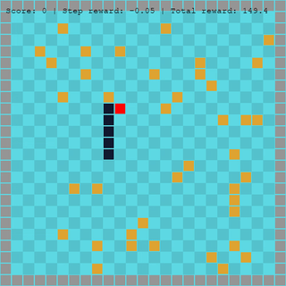

# Snake
Simple snake game with tf-agents integration for training agents with Reinforcement learning.
The game uses pygame framework.

# Results of training

I saw the best results using PPO optimizer and simple neural network with 3 convolution layers.
The input is represented as tensor of [gaem_width, game_height, 5], each of the element of grid being one-hot encoding of 5 classes [apple, obstacle, snake_head, snake_tail, empty_space].

I had to do couple of tricks in order to train faster:
1. Generate games with lot of apples, so that there is a higher chance of eating one by snake.  
  This helps a lot especially on the beginning of training, as snake makes random moves.
2. Add a penalty when snake moves in a circle - many times the agent moves in 2x2 circle by performing the same action (move left or right).
It might be because the agent is penalized highly (-100 points) for hitting the wall so it tries to stay alive (although every move is penalized by -0.05).
3. Stop the game if the agent did not ate any apple in last 50 moves.  This make it sample more interesting games.
